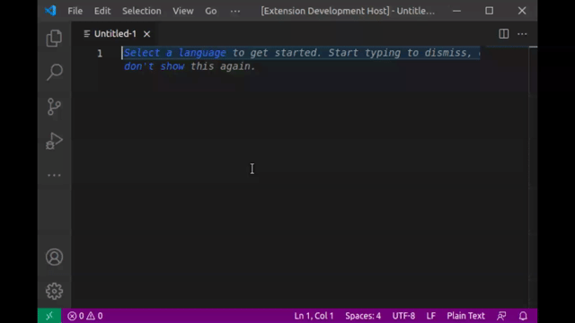
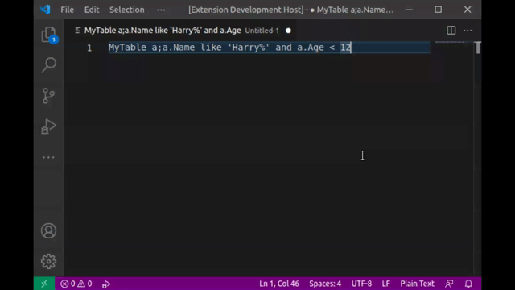

# copyed

Cache a gist content and paste it anywhere when editing with copyed.

## Paste a snippet from your gist

copyed will load every files in your gist that you can choose. The example above is using [this gist](https://gist.github.com/fendy3002/0f4d90156fdc9ac7fe38a80b7769c639) with file [mysql select.njs](https://gist.github.com/fendy3002/0f4d90156fdc9ac7fe38a80b7769c639#file-mysql-select-njs).

## Templating and parsing arguments

Parse multiple arguments (with delimiter) and use it to parse the template defined in the gist.
## Extension Settings

This extension has the following settings:

* `copyed.gistId`: GitHub Gist ID to load
* `copyed.argsDelimiter`: Delimiter for arguments. Default is a semicolon ";"
* `copyed.keyValueDelimiter`: Delimiter for key-value for each argument. Default is double colon "::"

## Known Issues

None so far

## Release Notes
### 0.0.1

Prototyping / proof of concept